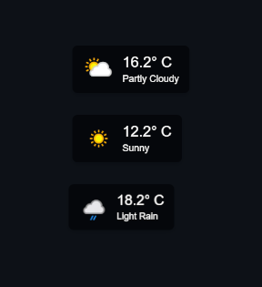

# Weather Overlay for OBS

This is a basic customizable HTML/Javascript weather overlay for OBS that displays real-time weather information using the WeatherAPI. The overlay shows the current temperature, weather description, and an icon representing the weather condition.

## Features

- **Real-time Weather Display**: Displays the current weather conditions for a specified city.
- **Customizable**: Configure the API key, city, and temperature units via query parameters.
- **Simple and Clean Design**: A visually appealing overlay with a modern, semi-transparent background and rounded corners.
- **Automatically updates**: The widget will automatically update every 10 minutes.

## Usage

To use this overlay, add the `weather_overlay.html` file as a browser source in OBS. You can customize the overlay using query parameters.

### Query Parameters

| Parameter | Type   | Required | Description                                                                                  | Default  |
|-----------|--------|----------|----------------------------------------------------------------------------------------------|----------|
| `api_key` | String | **Yes**  | Your WeatherAPI key. You can get a free API key by signing up at [WeatherAPI](https://www.weatherapi.com/). | None     |
| `city`    | String | **Yes**  | The city for which to fetch the weather data.                                                 | None     |
| `units`   | String | No       | The unit for temperature. Use `metric` for Celsius or `imperial` for Fahrenheit.              | `metric` |

### Example URL
`file:///C:/path/to/weather_overlay.html?api_key=your_weatherapi_key&city=London&units=metric`

### How it looks inside OBS (3 locations added)

